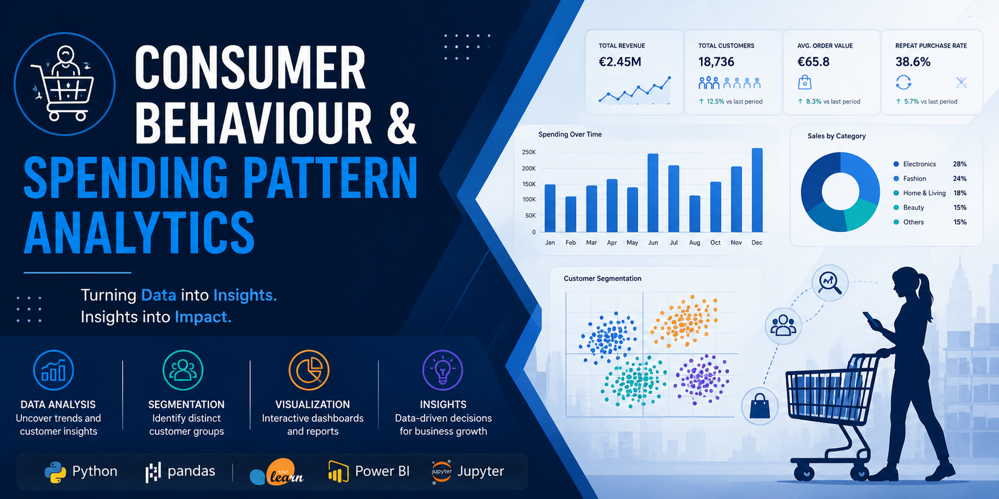

# Consumer Behaviour & Spending Pattern Analytics

## Executive Summary

This project focuses on analysing customer purchasing behaviour and spending patterns using data analytics and machine learning techniques. The primary objective is to identify meaningful customer segments, uncover purchasing trends, and generate actionable business insights that can support data-driven decision-making.

The project combines Exploratory Data Analysis (EDA), customer segmentation using K-Means Clustering, and data visualization techniques to better understand consumer behaviour and improve strategic business decisions.

The analysis aims to simulate real-world business analytics workflows commonly used in retail, e-commerce, and customer intelligence domains.

---

## Business Problem

Businesses often struggle to understand customer purchasing behaviour, identify high-value customer groups, and personalise marketing strategies effectively.

Without customer segmentation and behavioural analysis:

* Marketing campaigns become less targeted
* Customer retention strategies become inefficient
* Businesses fail to maximise customer lifetime value
* Decision-making becomes less data-driven

This project addresses these challenges by analysing customer behaviour data to discover trends, spending patterns, and distinct customer segments.

---

## Project Objectives

* Perform Exploratory Data Analysis (EDA) on customer transaction data
* Analyse customer spending behaviour and purchasing trends
* Identify customer segments using K-Means Clustering
* Generate business insights from customer behaviour patterns
* Create visualizations and dashboards for better decision-making
* Simulate a real-world business analytics workflow

---

## Dataset Overview

The dataset contains customer-related information including demographic details, purchasing behaviour, spending metrics, and transaction-related attributes used for behavioural analysis and segmentation.

Key areas analysed include:

* Customer demographics
* Spending patterns
* Purchase frequency
* Customer distribution
* Segment-based behavioural trends

---

## Tools & Technologies

### Programming & Analysis

* Python
* Jupyter Notebook

### Libraries

* Pandas
* NumPy
* Matplotlib
* Scikit-learn

### Visualization & BI

* Power BI
* Data Visualization Techniques

### Machine Learning

* K-Means Clustering

---

## Project Workflow

1. Data Collection & Understanding
2. Data Cleaning & Preprocessing
3. Exploratory Data Analysis (EDA)
4. Feature Engineering
5. Customer Segmentation using K-Means
6. Data Visualization & Insights
7. Business Recommendations

---

## Exploratory Data Analysis (EDA)

The EDA phase focuses on understanding:

* Customer spending distribution
* Purchase behaviour patterns
* Correlations between variables
* Outlier detection
* Trends and anomalies in customer activity

Visualizations are used extensively to identify behavioural insights and support analytical findings.

---

## Customer Segmentation

Customer segmentation is performed using K-Means Clustering to group customers based on behavioural and spending characteristics.

The segmentation process helps identify:

* High-value customers
* Low-engagement customers
* Moderate spenders
* Distinct behavioural groups

These insights can support targeted marketing, customer retention, and strategic business planning.

---

## Key Insights

Some major analytical insights identified during the project include:

* Variations in spending behaviour across customer groups
* Identification of high-value customer segments
* Customer groups with different purchasing patterns
* Behavioural trends useful for business strategy and personalization

Additional insights and dashboard visualizations will be added as the project progresses.

---

## Business Recommendations

Based on analytical findings, businesses can:

* Develop targeted marketing campaigns
* Improve customer retention strategies
* Personalise customer experiences
* Optimise promotional efforts
* Focus on high-value customer segments

These recommendations demonstrate how analytics can support practical business decision-making.

---

## Future Improvements

Future enhancements planned for this project include:

* Interactive Power BI dashboards
* Advanced customer analytics
* Predictive modelling
* Recommendation systems
* SQL integration for analytics workflows
* Deployment of visual analytics applications

---

## Project Status

Project currently in active development with ongoing improvements in:

* Exploratory Data Analysis
* Machine Learning Models
* Dashboard Development
* Business Insight Generation

Further updates and visualizations will be added progressively.
